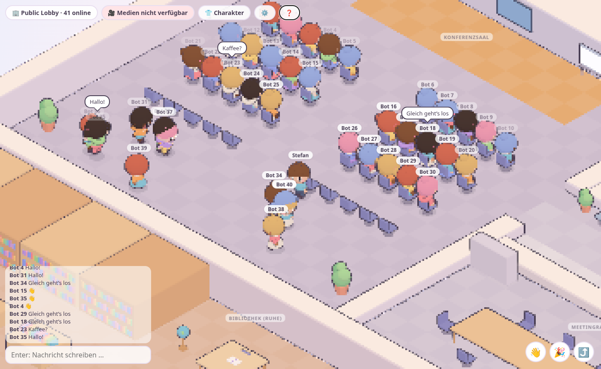

# PoC 2 – Das Büro in 3D (React Three Fiber) mit Chibi-Charakter-Editor

Stand: 30.09.2026 · Branch `poc/threejs-r3f` · Pakete `client-3d/`, `packages/media/`, `server/`, `types/`, Map in `assets/map/`

> **Hinweis:** Der 2D-Client (`client/`) und die Whiteboards sind inzwischen entfernt, das Repo ist eine eigenständige 3D-Demo. Alles, was unten 2D und 3D vergleicht (Gesamtempfehlung, die 5 PoC-Fragen, Phase 1), ist die **Historie** der PoC-Auswertung und beschreibt den Stand vor dem Entfernen. Die Befehle unter „So teste ich das“ und die LiveKit-Checkliste sind aktuell.



## Gesamtempfehlung (Historie)

**Weiter in 3D – als Hybrid-Übergang, nicht als harter Schnitt.**

Der 3D-Client hängt am selben Colyseus-Server und spricht dasselbe Positions- und Anim-Format wie der Phaser-Client. 2D- und 3D-Spieler treffen sich also schon heute im selben Raum (getestet). Damit gibt es keinen Big Bang: Phaser bleibt der stabile Standard, der 3D-Client wächst daneben, bis er Feature-Parität hat. Video/Audio mit Nähe-Logik läuft seit Phase 1 über denselben Code wie in 2D, ist aber noch nicht gegen einen echten LiveKit-Server getestet (Checkliste unten). Danach entscheidet ein kurzer A/B-Test mit echten Nutzern (2D vs. 3D klar vs. 3D Pixel-Look), ob Phaser abgelöst wird.

Warum nicht bei Phaser bleiben: In einem autonomen Lauf waren alle P0- und P1-Punkte und der Großteil von P2 machbar. Die Performance reicht für 40 Personen auf einer integrierten Laptop-GPU mit Reserve. Und der Charakter-Editor, parametrisch statt Pixel-Sprite-Sheets, ist ein echter Gewinn, den Phaser nur mit viel Pixel-Art-Aufwand bieten könnte.

Warum nicht sofort umsteigen: Ob die Knuffigkeit wirklich trägt, müssen Nutzer beurteilen, nicht ich. Außerdem ist Proximity-Video/-Audio in 3D erst gebaut, nicht mit echten Gesprächen erprobt.

## Stand der Prio-Stufen (Historie, 2D-Bezüge veraltet)

| #     | Punkt                                                        | Stand | Anmerkung                                                                                                                                                                                                                                                                                                                                                                                                                   |
| ----- | ------------------------------------------------------------ | ----- | --------------------------------------------------------------------------------------------------------------------------------------------------------------------------------------------------------------------------------------------------------------------------------------------------------------------------------------------------------------------------------------------------------------------------- |
| P0.1  | `client-3d/` als Workspace, `npm run dev:client3d`           | ✅    | Vite + React 19 + R3F 9 + drei. Zusätzlich `npm run dev3d` (heute `npm run dev`: Server + 3D-Client), `build:client3d`. Port 3100.                                                                                                                                                                                                                                                                                          |
| P0.2  | Colyseus-Sync: Position, Drehung, Avatar, Anim               | ✅    | Neue Player-Felder `avatar` (JSON) und `rot`, neue Messages `UPDATE_PLAYER_AVATAR`, `PLAYER_EMOTE` (ans Enum angehängt). Positionen in Map-Pixeln, Anims im 2D-Format (`lucy_run_left`) → 2D- und 3D-Spieler sehen sich gegenseitig (Node-Test + Browser).                                                                                                                                                                  |
| P0.3  | Map mit allen Räumen als Toon-Diorama, Kollision aus der TMX | ✅    | Konferenzsaal (Bühne, 40 Stühle), Meetingraum, Bibliothek (Ruhezone), Lounge mit Getränkeautomat und Billard, Chefbüro, Großraumbüro, Flure. Kollision exakt aus den Tiled-Daten (Skript, s. u.).                                                                                                                                                                                                                           |
| P0.4  | Chibi aus Teilen                                             | ✅    | Prozedural aus Primitives (Quaternius liefert nur über Google Drive/itch.io, nicht skriptbar). Großer Kopf, Stummelbeine, große Augen, Bäckchen, Toon + Outline.                                                                                                                                                                                                                                                            |
| P0.5  | Charakter-Editor                                             | ✅    | Haut, 4 Frisuren, Haarfarbe, 3 Oberteile + Farbe, Hose/Shorts/Rock + Farbe, freie Farbwahl, Vorlagen, Zufall, drehbare animierte Vorschau (OrbitControls, Stehen/Laufen/Sitzen/Winken/Jubeln), localStorage, Sync an alle.                                                                                                                                                                                                  |
| P0.6  | WASD + Klick-zum-Laufen + Zoom                               | ✅    | WASD bildschirmrelativ, Klick → A\* auf Viertel-Kachel-Raster mit Pfadglättung, Mausrad-Zoom.                                                                                                                                                                                                                                                                                                                               |
| P0.7  | Nametags, Chat, Sprechblasen                                 | ✅    | Chat nutzt die `chatMessages` des Servers (gemeinsam mit 2D). Namen verblassen mit Entfernung, Sprechblasen immer sichtbar.                                                                                                                                                                                                                                                                                                 |
| P0.8  | Stühle: E/Klick, Belegung, „Plumps"                          | ✅    | Belegung wird aus den Positionen abgeleitet (auch 2D-Spieler belegen Stühle). Plumps: kurzer Hüpfer, Fall, Squash & Wobble.                                                                                                                                                                                                                                                                                                 |
| P1.9  | Computer, ~~Whiteboard~~, Getränkeautomat                    | ✅/⚠️ | Computer: Screen-Share über LiveKit mit derselben `ScreenShareSession` wie 2D (`packages/media`), Freigabe auch als Bild auf dem 3D-Monitor (Phase 1). Meldet ohne Server nach ~4 s „nicht verfügbar". Mit echtem LiveKit **nicht getestet**. Whiteboard: **entfernt** (Client, Server, Messages); geplant ist ein externer Dienst wie Miro. Automat: Getränk wählen → Becher in der Hand mit Schlücken, für alle sichtbar. |
| P1.10 | Emotes, Idle-Variationen, Hüpf-Feedback                      | ✅    | Winken (1), Jubeln (2), Hüpfen (Leertaste), Umschauen/Strecken nach längerem Stehen, Blinzeln. Emotes sieht nur der 3D-Client (2D ignoriert die Message).                                                                                                                                                                                                                                                                   |
| P1.11 | Pixel-/PostFX-Umschalter                                     | ✅    | Einstellungen → Look: klar / Pixel (Pixelation + Tiefenkanten) / Kanten-Post-FX statt Inverted Hull.                                                                                                                                                                                                                                                                                                                        |
| P2    | Mobil-Joystick                                               | ✅    | Auf Touch-Geräten, analog. Kein Pinch-Zoom, UI nicht für kleine Screens optimiert.                                                                                                                                                                                                                                                                                                                                          |
| P2    | Instancing/LOD + FPS-Messung                                 | ✅    | Stühle instanziert, Chibis pro Segment gemergt, Kulisse gebacken, Frustum-Skip der Animation, Mess-Skripte. Kein LOD.                                                                                                                                                                                                                                                                                                       |
| P2    | Login/Raumauswahl                                            | ✅    | Öffentliches Büro, eigene Räume aus der Lobby (mit Passwort), eigenen Raum anlegen.                                                                                                                                                                                                                                                                                                                                         |
| P2    | Preset-Migration adam/ash/lucy/nancy                         | ✅    | Die vier Figuren gibt es als Chibi-Vorlagen. 2D-Spieler erscheinen in 3D als ihre Vorlage, 3D-Spieler in 2D als die im Editor gewählte Figur.                                                                                                                                                                                                                                                                               |
| P1+   | **Video/Audio mit Nähe/Zonen (LiveKit)**                     | ✅/⚠️ | Phase 1: gleicher `MediaManager` wie 2D, gleiche Reichweite, Zonen und Ruhezone, Mikro/Kamera/Lautsprecher-Dialog, Video-Kacheln, grüner Ring am Namen beim Sprechen. Ohne LiveKit geprüft (Rauchtest), mit echtem Server **noch nicht** (Checkliste unten).                                                                                                                                                                |

## Die 5 PoC-Fragen (Historie)

### 1. Ist die Knuffigkeit in 3D erreicht?

Meine Einschätzung: **weitgehend ja, mit Einschränkungen.** Screenshots liegen in [`docs/poc2/`](docs/poc2).

- Was trägt: die Chibi-Proportionen (Kopf ≈ halbe Körperhöhe), die großen glänzenden Augen mit Bäckchen, das Hüpfen beim Laufen, das Wippen im Stehen, der „Plumps" beim Hinsetzen, das Blinzeln, die Pastellpalette und die Toon-Bänder. Das Büro wirkt wie ein Spielzeug-Diorama aus Holzklötzchen und Knetfiguren.
- Was schwächer ist als in 2D: In der Standard-Iso-Ansicht sind die Gesichter nur ~25–40 px groß. Der Pixel-Art-Charme der LimeZu-Sprites (viele liebevolle Details auf wenigen Pixeln) wird durch „glatte" Primitives ersetzt. Die Möbel sind bewusst schlicht (abgerundete Boxen), die 2D-Map ist deutlich detailreicher. Einige Dekor-Objekte der Tiled-Map sind in 3D ausgeblendet oder zu Blöcken vereinfacht.
- Der **Pixel-Look** (Einstellungen) schlägt eine Brücke: 3D-Diorama mit Pixelkanten und scharfen DOM-Namensschildern. Subjektiv ist das die knuffigste Variante.
- Was Nutzer vergleichen müssen, am besten nebeneinander (2D auf :3000, 3D auf :3100, gleicher Raum):
  1. die eigene Figur im 2D-Sprite vs. selbst gestalteter Chibi (ist der Editor den Verlust an Pixel-Detail wert?),
  2. 3D klar vs. 3D Pixel-Look,
  3. Lesbarkeit von Gesichtern und Namen auf normalem Zoom,
  4. das Gefühl beim Laufen, Hinsetzen und Winken (Animation statt 4-Richtungs-Sprites),
  5. Übersicht im vollen Konferenzsaal.

### 2. Asset-/Map-Workflow: Blender/glTF vs. prozedural, Aufwand für einen neuen Raum

**Umgesetzt (prozedural, Tiled bleibt die Quelle):**

1. Den Raum wie heute in Tiled bauen (Tiles, Objekt-Layer, `collides`, Stühle mit `direction`, Computer/Whiteboards, Zonen).
2. `npm run extract-map` ausführen. `client-3d/scripts/extract-map.mjs` liest `assets/map/map.json` und die Tileset-PNGs aus `assets/map/tilesets/` und erzeugt `client-3d/src/map/office.generated.json` mit
   - begehbaren Kacheln (Flood-Fill ab Spawn) und Wandkacheln,
   - Kollisionsrechtecken nach denselben Regeln wie Phaser (Tile-Property `collides`, `*OnCollide`-/`Basement`-Layer, Layer-Property `collides`, Automat),
   - „Komponenten": je Layer zusammenhängende Deko-Objekte mit Bounding Box und **aus den Pixeln gemittelter Farbe**,
   - Stühlen, Computern, Whiteboards, Automat und Zonen.
3. Fertig, der Raum ist in 3D begehbar: Böden und Wände bekommen die (pastellisierten) Farben ihrer Tiles, Wände werden per Greedy-Meshing zu Blöcken zusammengefasst, Grünes wird zur Pflanze, Wandobjekte werden zu Bildern, alles Blockierende wird zur abgerundeten Box in der Pixel-Farbe.
4. Optional für mehr Liebe: in `client-3d/src/world/furniture.tsx` die Position einer Komponente einem Prefab zuordnen (`'21,7': 'poolTable'`). Es gibt 15 Prefabs: Tisch, Pult, Billard, Bücherregal, Pflanze, Schrank, Wasserspender, Drucker, Kartons, Globus, Bild, TV …

**Aufwand für einen neuen Raum** (z. B. so groß wie die Bibliothek): Tiled wie heute, dazu 0 min für „begehbar und erkennbar" und etwa 15–45 min Prefab-Zuordnung für „hübsch", solange die vorhandenen Prefabs passen. Ein neues Prefab (z. B. ein Sofa) kostet 15–30 min Code aus Primitives.

**Blender/glTF als Alternative:** Kollision und Layout weiterhin aus Tiled, Möbel als glTF-Prefabs aus einem Kit (KayKit/Quaternius Furniture, CC0) mit `useGLTF`, Materialien beim Laden durch unser Toon-Material ersetzen. Aufwand pro Raum etwa 2–4 h Platzieren und Abstimmen, ein eigenes Modell in Blender 1–4 h pro Möbel für Nicht-Artists. Mehr Detail und mehr Charme pro Objekt, aber zwei Quellen (Tiled + glTF), die synchron bleiben müssen.

**Empfehlung:** Tiled als einzige Layout- und Kollisionsquelle behalten. Die Prefab-Tabelle ist die Nahtstelle: Heute zeigt sie auf prozedurale Prefabs, später kann sie auf glTF-Modelle zeigen.

### 3. Stilvereinheitlichung: freie Assets vs. eigene

- **Eigene/prozedurale Assets** (so umgesetzt): automatisch einheitlich, weil alles dasselbe Toon-Material (3-Band-Gradient), dieselbe Palette, dieselbe Kontur und dieselben Rundungen nutzt. Die Grenze ist das Detail: Alles sieht nach „Holzspielzeug" aus. Das ist gewollt, aber limitiert.
- **Freie Kits:** innerhalb _eines_ Kits sehr einheitlich (KayKit ist selbst schon Toy-Style). Mehrere Kits zu mischen (KayKit + Quaternius + Kenney) fällt sofort auf: andere Polygondichte, Proportionen und Texturierung (Atlas vs. Vertex-Farbe). Vereinheitlichen geht über (a) Material-Override auf unser Toon-Material mit gemappten Palettenfarben, (b) dieselbe Kontur, (c) einheitliche Skalierung. Das holt viel heraus, Proportionsunterschiede bleiben.
- **Figuren:** Ein Charakter-Kit mit austauschbaren Teilen (Haare, Kleidung) muss von _einem_ Hersteller kommen, sonst passen Rigs und Proportionen nicht. Prozedurale Chibis sind hier bewusst die robustere Wahl: Jede Kombination aus Frisur, Kleidung und Farbe funktioniert, und das Datenformat ist ein winziges JSON.
- **Empfehlung:** höchstens eine Kit-Familie plus eigene Prefabs, immer mit Material-Override. Figuren prozedural lassen.

### 4. Performance

Messaufbau: AMD Ryzen 7 7735HS mit **integrierter Radeon 680M**, Chromium 153 headless auf der echten GPU (Vulkan), 1600×900, DPR 1, **ohne Vsync/Frame-Limit** (die Werte zeigen die Reserve über 60 FPS). Produktions-Build. 40 Bots per `scripts/bots.mjs` (30 sitzen im Konferenzsaal, 10 laufen, alle mit Zufallsavatar, chatten und winken), plus ich. Messung: `scripts/measure.mjs`, Mittel über 8 s. „4× CPU" = Chromium-CPU-Drosselung, als Näherung für einen schwachen Büro-Laptop.

| Szene (41 Chibis)                    | FPS vor Optimierung | FPS nach Optimierung | FPS nach Opt., 4× CPU | Draw Calls vorher → nachher |
| ------------------------------------ | ------------------: | -------------------: | --------------------: | --------------------------: |
| Übersicht ganzes Büro (ohne Spieler) |                 480 |                  692 |                   237 |                   822 → 137 |
| Flur (Chibis außerhalb des Bildes)   |                 297 |                  566 |                   109 |                    205 → 80 |
| Konferenzsaal voll, Konturen an      |                 134 |              **222** |                **55** |                  1543 → 378 |
| Konferenzsaal voll, Konturen aus     |                 168 |                  437 |                    73 |                  1111 → 225 |
| Konferenzsaal voll, Pixel-Post-FX    |                 136 |                  254 |                    62 |                           – |
| Konferenzsaal voll, Kanten-Post-FX   |                 177 |                  489 |                    78 |                           – |

(„Vorher" ist der Stand vor den Optimierungs-Commits, `53be248`, gleicher Messaufbau. Die ganz frühe Version mit einer drei-`<Html>`-Root pro Namensschild lag im Dev-Build mit 81 Chibis bei 73 FPS.)

Umgesetzte Optimierungen, jeweils gemessen: ein DOM-Layer für alle Namensschilder statt einer React-Root pro Spieler, Animation nur für Chibis im Sichtfeld, Chibi-Teile pro animiertem Segment zu einer Geometrie mit Vertex-Farben gemergt (≈15 statt ≈50 Draw Calls pro Figur, gecacht pro Avatar), statische Kulisse nach dem Mount zu 3 Meshes gebacken, Stühle instanziert. Das CPU-Profil zeigt jetzt vor allem three.js-Szenenverwaltung.

**Was für 40 Leute im Konferenzsaal nötig wäre:**

- Auf einer iGPU von 2022 reicht es heute (222 FPS). Auf einem schwachen Laptop (4× CPU) liegt der volle Saal bei 55 FPS, ohne Konturen bei 73. Das ist grenzwertig, aber nutzbar.
- Nächste Schritte, falls nötig: (1) Chibis vollständig instanzieren (alle Köpfe einer Frisur in einem InstancedMesh, ~20 Draw Calls für _alle_ Figuren); (2) Animations-LOD: weit entfernte oder sitzende Chibis mit 15 Hz animieren; (3) Konturen automatisch aus, wenn die FPS fallen; (4) DPR auf 1 begrenzen (auf HiDPI-Displays der größte GPU-Hebel).
- Netzwerk: Der 3D-Client sendet wie der 2D-Client maximal 15 Updates/s pro Spieler und nur bei Änderung. Für den Server ändert sich damit nichts gegenüber heute.
- Bundle: 3D-Client ≈ 1,0 MB three/R3F + 0,5 MB LiveKit + 0,5 MB App inkl. React/Colyseus/Map-Daten (gzip ≈ 0,55 MB gesamt), kleiner als der Phaser-Client (≈ 3 MB).

### 5. Pflege-/Erweiterungsaufwand vs. Phaser heute

| Aspekt       | Phaser (heute)                                                      | 3D/R3F (PoC)                                                                                                                                                                                                                    |
| ------------ | ------------------------------------------------------------------- | ------------------------------------------------------------------------------------------------------------------------------------------------------------------------------------------------------------------------------- |
| Code         | `client/src` ≈ 6 600 Zeilen                                         | `client-3d/src` ≈ 5 300 Zeilen TS/TSX + 620 CSS + Skripte, heute schon mit Editor, Raumwahl, Whiteboard, Screen-Share, Video-Chat (die LiveKit-Logik liegt geteilt in `packages/media`).                                        |
| Paradigma    | imperative Szene, Game-Objects, Event-Bus Phaser ↔ React/Redux      | alles React (Szene deklarativ, Animation in `useFrame`), ein Zustand-Store. Kein Brückencode zwischen zwei Welten.                                                                                                              |
| Neue Avatare | Pixel-Art-Sprite-Sheets mit allen Animationen (teuer, Artist nötig) | Parameter + Farbe; neue Frisur ≈ 20 Zeilen                                                                                                                                                                                      |
| Neue Räume   | Tiled                                                               | Tiled + Extraktor (+ optional Prefab-Zuordnung)                                                                                                                                                                                 |
| Neue Möbel   | Tile aus dem LimeZu-Set                                             | Prefab aus Primitives oder glTF (mehr Aufwand pro Objekt)                                                                                                                                                                       |
| Know-how     | Phaser                                                              | three.js/R3F, etwas 3D-Mathematik, Shader-Grundlagen (Outline, Post-FX), Performance-Denken (Draw Calls)                                                                                                                        |
| Risiken      | stabil, Phaser 4 gerade migriert                                    | R3F 9 verlangt React < 19.4 (Peer-Dependency; im 3D-Client auf `~19.3.0` festgelegt, React 19.3.0 ist auch die aktuelle Version), three.js ändert APIs häufig (z. B. `THREE.Clock` ist deprecated), Performance braucht Pflege. |
| Testbarkeit  | –                                                                   | Headless-Chromium mit echter GPU, Bots und Messskript sind im Repo                                                                                                                                                              |

Fazit: Der laufende Pflegeaufwand ist ähnlich. 3D ist bei Figuren und Interaktion billiger, bei Möbel-Detail und Performance teurer. Das Team braucht three.js/R3F-Grundwissen.

## Lizenzübersicht

| Was                                                                                                  | Lizenz                     | Anmerkung                                                                                                                                                              |
| ---------------------------------------------------------------------------------------------------- | -------------------------- | ---------------------------------------------------------------------------------------------------------------------------------------------------------------------- |
| Chibis, Möbel-Prefabs, Shader, UI (alles in `client-3d/`)                                            | MIT (wie das Repo)         | vollständig selbst erstellt, prozedural aus three.js-Primitives; **keine externen 3D-Modelle, Texturen oder Fonts**                                                    |
| Map-Layout und Farben                                                                                | wie der 2D-Client (LimeZu) | Der Extraktor liest die vorhandenen Tiled-Daten und Tileset-PNGs des Repos und speichert nur Rechtecke und gemittelte Farben. `client-3d` liefert keine Pixel-Art aus. |
| three.js 0.186, @react-three/fiber 9, @react-three/drei 10, @react-three/postprocessing 3, zustand 5 | MIT                        | npm                                                                                                                                                                    |
| postprocessing 6                                                                                     | Zlib                       | npm                                                                                                                                                                    |
| livekit-client 2                                                                                     | Apache-2.0                 | npm (wie im 2D-Client)                                                                                                                                                 |
| @colyseus/sdk 0.18                                                                                   | MIT                        | npm (wie im 2D-Client)                                                                                                                                                 |
| pngjs 7 (nur Build-Skript), playwright-core 1.63 (nur Messskripte)                                   | MIT / Apache-2.0           | devDependencies                                                                                                                                                        |
| Emojis in der UI                                                                                     | System-Font                | nicht mitgeliefert                                                                                                                                                     |
| Quaternius / KayKit                                                                                  | (CC0)                      | **nicht verwendet**: Die Downloads laufen über Google Drive bzw. itch.io und sind nicht automatisierbar. GitHub-Spiegel gibt es nur für andere Packs.                  |

## So teste ich das

```bash
npm install
npm run dev                   # Server :2567 + 3D-Client :3100
```

1. http://localhost:3100 öffnen, Namen eingeben, **„Charakter gestalten"**: Frisur, Farben und Kleidung wählen, die Vorschau mit der Maus drehen, „Laufen"/„Sitzen"/„Winken" probieren, speichern.
2. „Beitreten" (öffentliches Büro) oder einen eigenen Raum mit Passwort anlegen.
3. Mit **WASD** laufen, auf den Boden **klicken** (die Figur läuft um Hindernisse herum), mit dem **Mausrad** zoomen.
4. Auf einen **Stuhl klicken** oder davor **E** drücken → Plumps. Nochmal E zum Aufstehen.
5. **Enter** → Chat, die Sprechblase erscheint über dem Kopf. **1**/**2**/**Leertaste** → Winken/Jubeln/Hüpfen.
6. In der Lounge am Getränkeautomaten **R** → Getränk wählen. Am Computer **R** → ohne LiveKit erscheint „nicht verfügbar", mit LiveKit „Bildschirm teilen" und „📺 Auf dem Monitor zeigen".
7. Ein zweites Fenster im selben Raum öffnen: Bewegung, Sitzen, Chat, Emotes und Avatar kommen in beide Richtungen an.
8. ⚙️ → Look „Pixel-Look" und „Kanten-Post-FX", Konturen und Wände umschalten, FPS-Anzeige.
9. Volles Haus: `npm run bots -- 40 ws://localhost:2567` und in den Konferenzsaal laufen.
10. Messen: `node client-3d/scripts/measure.mjs http://localhost:3100/` (optional `CPU_THROTTLE=4`, `CHROME_PATH=…`).
11. Figurengalerie: http://localhost:3100/?gallery
12. Video-Chat-Oberfläche ohne LiveKit: `node client-3d/scripts/media-smoke.mjs` (Headless-Chromium mit Fake-Kamera: Beitreten, Geräte-Dialog, Mikro/Kamera umschalten, Ruhezone, Computer-Dialog; `FRESH=1` für einen Erstbesuch).

Ohne LiveKit bleibt alles außer Medien nutzbar. Der HUD zeigt „🎥 Video-Chat nicht verfügbar" (neuer Versuch alle 10 s), in der Bibliothek „🤫 Ruhezone". Mit LiveKit: `npm run dev:livekit` zusätzlich starten und die [Checkliste](#livekit-checkliste-für-den-externen-server) durchgehen.

## Weitere ehrliche Grenzen

- Video/Audio und Screen-Share in 3D sind gegen einen echten LiveKit-Server ungetestet (s. [Phase 1](#phase-1-video-und-audio-mit-nähe-in-3d)).
- Der Kamerawinkel ist fest (keine Drehung). Die „abgesenkten Wände" sind eine feste Regel, keine dynamische Durchsicht.
- Wie in 2D sind die Möbel nur so genau wie die Kollisionsrechtecke; einige 2D-Dekor-Objekte fehlen in 3D oder sind stark vereinfacht (z. B. Bücherregale als große Blöcke).
- Whiteboards gibt es nicht mehr (weder Client noch Server); geplant ist die Einbindung eines externen Dienstes wie Miro.
- Mobile: Joystick ja, aber kein Pinch-Zoom und nicht für kleine Screens gestaltet.
- Einstellungswechsel (Konturen, Wände) backen die Kulisse neu, was einen kurzen Ruckler gibt.

## Phase 1: Video und Audio mit Nähe in 3D (Historie)

Stand 30.09.2026. Ziel war, dass der 3D-Client wie der 2D-Client spricht und hört, mit derselben Nähe- und Zonenlogik. Getestet ist alles **ohne** LiveKit-Server (keiner vorhanden, und ohne externe Downloads nicht beschaffbar); für den Test mit echtem Server siehe die [Checkliste](#livekit-checkliste-für-den-externen-server).

### Was gebaut ist

**Geteiltes Paket `packages/media/` (`@skyoffice/media`, npm-Workspace, reiner TS-Quellcode, von Vite mitgebaut):**

- `MediaManager`, `ScreenShareSession` und die Geräte-Helfer (`mediaDevices`) liegen jetzt hier statt in `client/src/web/`. Die 3D-Kopie der `ScreenShareSession` ist gelöscht.
- Entkopplung vom Store: Der Manager importiert keinen Store mehr. Der Client übergibt zwei Callbacks (`onVideoConnected`, `onTrackStateChange`). Der 2D-Client dispatcht darin dieselben Redux-Actions wie vorher, der 3D-Client schreibt in seinen Zustand-Store. (Anders als in der Aufgabe vermutet nutzt der 3D-Client nicht den Redux-Store, sondern Zustand; deshalb Callbacks statt eines gemeinsamen Stores.)
- Geteilte Konstanten: `NEAR_DISTANCE` 110 px / `FAR_DISTANCE` 170 px (Hysterese), `MEDIA_UPDATE_INTERVAL` 250 ms. Die Zonen-Regeln (`getMediaLocation` in `types/Media.ts`) teilen sich Server, 2D und 3D ohnehin.
- `@skyoffice/media/react` (Unterpfad, damit der Kern React-frei bleibt): `useMediaSetup` (Vorschau-Stream, Geräteauswahl, Einstellungen) und `useMicLevel`. Der 2D-Dialog nutzt dieselben Hooks.
- Optionale Optionen nur für 3D: `connectOptions` (3D: `maxRetries: 0`, `websocketTimeout: 4000`, damit „nicht verfügbar" nach Sekunden statt nach ~15 s kommt), Fehlermeldungen der Bildschirmfreigabe, `connected`-Flag im Snapshot.

**3D-Client:**

- `client-3d/src/media/media.ts`: ein `MediaManager` pro Colyseus-Sitzung. Alle 250 ms bekommt er wie in 2D den Medien-Ort und die Abstände. Position ist die zuletzt an den Server gesendete Position in Map-Pixeln (dieselbe, mit der der Server die Tokens vergibt und die 2D-Spieler sehen), Abstände zu den Server-Positionen der anderen, Zonen aus `office.generated.json` zurück in Pixel umgerechnet. Damit gelten dieselbe Reichweite, dieselben Räume (Meetingraum, Konferenzsaal/Bühne) und die Ruhezone Bibliothek.
- HUD (oben links, in der Pillen-Optik): Status (🎥 Video-Chat / 🎧 Publikum / 🤫 Ruhezone / 🎥 Video-Chat nicht verfügbar), Mikro- und Kamera-Schalter, 🎛️ für Geräte. Vor dem ersten Einrichten ein grüner Knopf „🎙️ Mikro & Kamera".
- Einrichtungsdialog (`ui/MediaSetup.tsx`): Vorschau, Mikro/Kamera an/aus, Kamera, Mikrofon, Pegel, Lautsprecher mit Testton. Pastell, abgerundet. Gleiche Einstellungen und gleicher Speicherschlüssel wie 2D (wegen des anderen Ports aber eigener localStorage).
- Wurde Kamera/Mikro früher schon erlaubt, holt sich der Client den Stream nach dem Beitreten selbst (wie der Login-Dialog in 2D).
- Video-Kacheln rechts (`ui/VideoGrid.tsx`): eigene und die der Leute, die ich höre, mit Stimme über den gewählten Lautsprecher. Wer spricht, bekommt einen mintgrünen Rand.
- **Wer spricht**: Das Namensschild über dem Kopf bekommt einen pulsierenden grünen Ring und 🔊, stummgeschaltete Mikros zeigen 🔇. Grundlage sind die Active Speakers von LiveKit (vom Server aus dem Audiopegel der Tracks ermittelt). Das gilt für 2D- und 3D-Spieler gleich, weil beide mit ihrer Colyseus-Session-ID im selben LiveKit-Raum sind. Es leuchten nur Leute, die ich tatsächlich höre (und ich selbst). Namen von Sprechenden verblassen nicht mit der Entfernung.
- **Screen-Share**: Computer-Klick öffnet denselben Ablauf wie 2D (`ScreenShareSession`). Neu: „📺 Auf dem Monitor zeigen" schließt den Dialog, ich bleibe am Computer, die Sitzung läuft weiter, und die Freigabe (die eines anderen, sonst meine eigene) erscheint als Textur auf den Monitoren dieses Tisches. Weglaufen (> 1,5 Kacheln) verlässt den Computer. Ohne Server bleibt es beim Dialog mit „nicht verfügbar".
- Nebenbei behoben: Bei Doppeltischen standen die beiden Monitore Bildschirm an Bildschirm und verdeckten sich; jetzt Rücken an Rücken.

**Monitor-Textur und Ruckeln** (Radeon 680M, Chromium headless auf der GPU, ohne Vsync, 1080p30-Teststream aus einem Canvas, Mittel über 5 s):

| Variante                                           | FPS ohne Textur | FPS mit Textur | Kosten pro Frame |
| -------------------------------------------------- | --------------: | -------------: | ---------------: |
| `THREE.VideoTexture` (jeder Frame in voller Größe) |             586 |            529 |        ≈ 0,18 ms |
| **Canvas 480×256, max. 15 fps** (umgesetzt)        |             595 |            587 |        ≈ 0,02 ms |

Die p99-Frame-Zeit änderte sich in beiden Fällen nicht. Der Monitor ist auf dem Bildschirm nur ~100 px breit, deshalb die kleine Canvas-Variante.

### Was sich im 2D-Client geändert hat (nur durch die Extraktion)

Importe von `../web/…` auf `@skyoffice/media` bzw. `@skyoffice/media/react`; `Network.ts` übergibt die Redux-Dispatches als Callbacks; `Game.ts` importiert `MEDIA_UPDATE_INTERVAL` statt es selbst zu definieren; `MediaSetup.tsx` nutzt die geteilten Hooks; `livekit-client` ist jetzt Abhängigkeit von `packages/media`. Werte, Texte und Abläufe sind unverändert. Geprüft: Typecheck, Build und im Browser (Fake-Kamera) Login → Beitreten → Mikro aus/an → eigene Kachel → „Video chat is not available right now." ohne Seitenfehler.

### Getestet (ohne LiveKit-Server)

- `npm install`, `npm run typecheck`, `npm run build`, `npm run build:client3d`, `npm run lint`, `npm run format:check`: grün.
- Server, 2D- und 3D-Dev-Server: HTTP 200 auf :3000 und :3100.
- `node client-3d/scripts/media-smoke.mjs` (Chromium mit Fake-Kamera/-Mikro), alle 14 Prüfungen ok (dreimal hintereinander, dazu ein Lauf mit `FRESH=1`): beitreten, Mikro/Kamera werden übernommen, Mikro aus/an, Kamera aus, eigene Kachel, „Video-Chat nicht verfügbar" nach wenigen Sekunden, Geräte-Dialog, Ruhezone in der Bibliothek an und wieder aus, Computer-Dialog antwortet, keine Seitenfehler; 2D-Client lädt ohne Fehler.
- Monitor-Textur mit künstlichem Stream (Messung oben), Minimieren und Verlassen durch Weglaufen.
- Sprech-Ring nur optisch (Klasse von Hand gesetzt), weil es ohne LiveKit keine Active Speakers gibt.

### Bekannte Grenzen

- **Nichts davon lief gegen einen echten LiveKit-Server**: Gespräche, Nähe-Umschaltung, Active Speakers, Screen-Share und die Monitor-Textur mit echtem Track sind ungetestet.
- Die Monitor-Textur sehen nur die Leute, die an diesem Computer sind (der Server gibt den Computer-Raum nur an dessen Nutzer). Für alle sichtbare Bildschirme bräuchte es einen eigenen Abo-Pfad.
- Die Textur ist auf das Monitorformat gestreckt (kein Letterboxing).
- Der Sprech-Ring folgt der Active-Speaker-Erkennung von LiveKit (kurze Verzögerung), nicht einem eigenen Pegel pro Frame.
- Kamera/Mikro werden im HUD eingerichtet, nicht schon im Beitreten-Dialog wie in 2D.
- 3D bricht den LiveKit-Verbindungsaufbau nach 4 s ab; bei sehr langsamen Netzen könnte das zu früh sein (dann alle 10 s neuer Versuch).
- Nach einem Verbindungsabbruch zum Colyseus-Server entsteht beim erneuten Beitreten ein neuer Manager; der Kamera-Stream wird weiterverwendet.
- Kamera und Mikro brauchen einen sicheren Kontext (HTTPS oder `localhost`), siehe Checkliste.

## LiveKit-Checkliste für den externen Server

**1. LiveKit-Server** (auf der Testmaschine oder im Netz):

- Entwicklung: `livekit-server --dev --bind 0.0.0.0` (API-Key `devkey`, Secret `secret`, Signal-Port 7880; ohne `--bind` lauscht er nur auf localhost). Medien laufen über UDP 50000–60000 bzw. TCP 7881, diese Ports müssen vom Browser aus erreichbar sein.
- Produktion: eigener LiveKit-Server mit TLS (`wss://…`) oder LiveKit Cloud.

**2. Colyseus-Server** (`npm run dev:server` bzw. `npm start`), Umgebungsvariablen in der Shell setzen (es gibt kein `.env`-Laden):

| Variable             | Wert                                                                                                        |
| -------------------- | ----------------------------------------------------------------------------------------------------------- |
| `LIVEKIT_URL`        | URL, unter der **der Browser** LiveKit erreicht, z. B. `ws://192.168.1.20:7880` oder `wss://lk.example.com` |
| `LIVEKIT_API_KEY`    | API-Key des LiveKit-Servers (`devkey` bei `--dev`)                                                          |
| `LIVEKIT_API_SECRET` | Secret (`secret` bei `--dev`)                                                                               |

Ohne diese Variablen nimmt der Server außerhalb von `NODE_ENV=production` die `--dev`-Werte mit `ws://localhost:7880`, das passt nur, wenn LiveKit auf dem Rechner des Browsers läuft. Mit `NODE_ENV=production` und fehlenden Variablen ist Video aus (Warnung im Server-Log). Die URL geht unverändert in den Token an den Browser, sie muss also aus Sicht des Browsers stimmen.

**3. Clients:**

- Dev-Server: verbindet sich mit `ws(s)://<Hostname der Seite>:2567`, sonst `VITE_SERVER_URL=ws://host:2567 npm run dev:client3d`.
- Kamera/Mikro gibt es nur in sicherem Kontext: `http://localhost:…` oder HTTPS. Von einem anderen Rechner per `http://192.168.…` geht es **nicht** (`navigator.mediaDevices` fehlt). Auswege: SSH-Portweiterleitung (`ssh -L 3100:localhost:3100 -L 2567:localhost:2567 host`), HTTPS-Proxy, oder zum Testen in Chromium `--unsafely-treat-insecure-origin-as-secure=http://192.168.1.20:3100`. Ist die Seite HTTPS, muss LiveKit `wss://` sein (Mixed Content).

**4. Erwartung beim Start:** Server-Log ohne „video chat is disabled"; im 3D-HUD nach dem Beitreten „🎥 Video-Chat" (nicht „nicht verfügbar"); Browser-Konsole ohne „Could not connect to the video chat".

**5. Testfälle** (je zwei Fenster/Rechner, am besten mit Kopfhörern gegen Rückkopplung):

| #   | Fall                  | Erwartung                                                                                                                                             |
| --- | --------------------- | ----------------------------------------------------------------------------------------------------------------------------------------------------- |
| 2   | 3D ↔ 3D               | beide hören und sehen sich im Großraumbüro, wenn sie nah beieinander stehen; Namen stimmen; der grüne Ring erscheint über dem Sprechenden.            |
| 3   | Stummschalten         | Mikro/Kamera-Schalter im HUD, 🔇 am Namen des anderen.                                                                                                |
| 4   | Nähe                  | auseinanderlaufen: ab ≈ 170 px (≈ 5 Kacheln) verschwindet die Kachel/Stimme, ab ≈ 110 px (≈ 3,5 Kacheln) kommt sie wieder.                            |
| 5   | Meetingraum           | alle im Raum hören sich unabhängig vom Abstand, Leute draußen nicht.                                                                                  |
| 6   | Konferenzsaal/Bühne   | im Saal „🎧 Publikum", nur wer auf der Bühne steht, spricht; alle im Saal hören die Bühne.                                                            |
| 7   | Bibliothek (Ruhezone) | beim Betreten „🤫 Ruhezone", Kacheln und Stimmen weg, niemand hört mich; beim Verlassen verbindet es wieder.                                          |
| 8   | Screen-Share          | beide an denselben Computer (R), einer teilt: der andere sieht die Freigabe im Dialog; im 3D-Client nach „📺 Auf dem Monitor zeigen" auf dem Monitor. |
| 9   | Screen-Share beenden  | „Freigabe beenden" bzw. die Browser-Leiste beendet die Freigabe, Monitor wird wieder hellblau/gelb.                                                   |
| 10  | LiveKit stoppen       | HUD zeigt nach wenigen Sekunden „nicht verfügbar", das Büro läuft weiter; nach LiveKit-Neustart verbindet es innerhalb von ~10 s wieder.              |
| 11  | Geräte wechseln       | 🎛️ → anderes Mikro/Kamera → „Übernehmen": das Gegenüber bekommt das neue Bild/die neue Stimme ohne neu zu verbinden.                                  |
